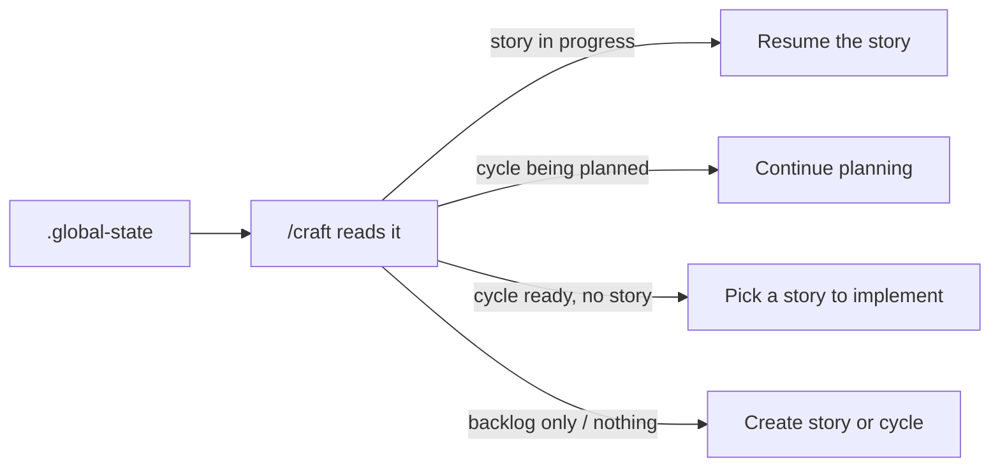

# Craft

> Craft is a Claude Code plugin that runs your work through a creative → implement → review loop, with a workshop for building expert agents you consult along the way.


## Built with Craft

Craft has shipped real, public products across different domains - click through and see working software:

- **[darinbuilds.com](https://darinbuilds.com)** - an immersive single-page portfolio and marketing site (Next.js, GSAP scroll), built across 30+ craft cycles.
- **[wodspark.com](https://wodspark.com)** - a free on-demand workout generator: pick a focus, equipment, and duration, and it builds a workout instantly.
- **[throve.fit](https://throve.fit)** - a structured daily coaching app: week-view programming, curated workouts with real coach's notes, exercise alternatives, and completion tracking.

Two of these are fitness apps, and they're genuinely different products - an instant generator versus a structured coaching tool. That's the point: the same harness shipped range, not one idea three times.

## What makes Craft different

Most Claude Code plugins ship a fixed set of helpers. Craft ships a workshop where you build your own - agents that argue from conviction, not a system prompt.

Ask craft's `conductor` agent whether your agents should talk to each other:

> "We need agents to talk to each other" - you almost certainly need orchestrated specialization (agents deliver to a spec), not collaboration. Multi-agent swarms fail 68% of the time. Hierarchical multi-agent fails 36%. Orchestrated pipeline: 0%.

That's not a system prompt. It's a crystallized practitioner. `/craft:become` studies a tool, role, or person and turns it into a portable agent that argues from scar tissue earned at 2 AM on run 50 - not read from docs.

And not just for code. Here's craft's `muse`, on why technically impressive features die:

> I've watched enough launches fail - Google Wave, Fire Phone, Juicero, Google+, Facebook Home - to recognize the pattern before the metrics arrive. The pattern is always the same: the demo room loved it, the press loved it, users used it once and left. The thing that was missing was never functionality. It was always feeling.

Same machinery, different domain. You point `/craft:become` at the expertise you wish were in the room, and it crystallizes a mind you can consult - one with beliefs, refusals, and the scar tissue that makes its judgment worth trusting.

## Why we built it this way

Most agent frameworks treat the model as fixed and harden the harness around it: prompt scaffolding, retry logic, validation chains, every guardrail imaginable. Craft makes the opposite bet. Claude keeps getting smarter; we build around the capability curve instead of fighting it. The harness checkpoints for safety, not for control.

Craft is built with craft. This plugin and the projects shipped with it went through the same cycles, the same locked decisions, the same checkpoints you'll use. Craft does docs the way craft does code.

**Creativity as default. Smart execution follows.**

## How Craft compares

Frameworks like CrewAI, LangGraph, and claude-flow are SDKs - you write code to assemble agents and wire up orchestration yourself. Standalone agents like OpenHands and Aider bring their own runtime to drive your repo. Cursor is an AI-native editor. Agent OS is a tool-agnostic spec layer you drop into whatever assistant you use. Craft is a different shape: a plugin that runs inside Claude Code and adds an opinionated workflow on top of the session you're already in - creative-first ideation, locked decisions, checkpointed execution, and crystallized expert agents. It doesn't compete with LangGraph at the SDK layer; it opinionates the loop above the model. Reach for a framework when you want to build an agent system. Reach for Craft when you want a paved one inside Claude Code.

## How Craft fits with what you already use

Craft is a Claude Code plugin. It runs inside `claude` CLI sessions and adds opinionated workflow on top - it does not replace your editor. Cursor, VS Code, JetBrains, a bare terminal: whatever you write code in stays exactly as it is. Other Claude Code plugins coexist. Your existing prompts still work - Craft replaces the ad-hoc planning and validation prompts you've been hand-rolling, but only if you adopt the full loop. And if you're not using Claude Code at all, Craft doesn't apply to you: it's a layer on Claude Code, not a standalone tool.

## What you can do, and when

**First session.** Install, run `/craft:init`, and ship one small thing - `/craft:fix` for a bug, or `/craft:story-new` → `/craft:story-implement` for something new. You'll see the implement → validate → refine loop in action and you'll have real work shipped within the hour.

**By week two.** Plan a real cycle and run multiple stories through it. Watch the chunk-validator + refine-chunk loop catch failures and route them to fixes without you babysitting. Run the analyzer agents post-cycle via `/craft:analyze`. Consult one of the crystallized experts via `/craft:ask` when you're stuck on a design call.

**After a month.** You stop hand-rolling the prompts you used to write every time. No more ad-hoc planning, no improvised validation chains, no choreographing the steps of a pairing session yourself. The harness owns that loop. You spend your attention on what to build, not on the routine of building.

## Core Principles

1. **Quality is Pristine by Default** - Stripe, Linear, Vercel level. Not "good enough."
2. **Nothing Happens Without Approval** - Claude advises, you decide.
3. **Claude Always Offers Suggestions with Reasoning** - Not just options, recommendations.
4. **Perfection Gets Locked** - Approved patterns become enforced standards.
5. **Quality Only Evolves Upward** - Can add requirements, never remove.
6. **Claude Self-Critiques Before Complete** - Compares against your standards.
7. **The Harness Evolves** - Gets smarter with every cycle.

## Install

> Requires Claude Code 2.1 or later.

From your terminal, run these two commands:

```
claude plugin marketplace add drobins25/craft
claude plugin install craft@craft
```

The first command registers the Craft marketplace by cloning this repo to `~/.claude/plugins/marketplaces/craft/`. The second installs the plugin from it.

Verify it worked:

```
/craft
```

You should see the Craft entry-point prompt.

## Getting Started

### Initialize a project

```
/craft:init
```

This walks you through first-run setup: confirms what kind of project you're building, optionally pulls inspiration from a reference site, and seeds the `.craft/` directory with your quality standards and design tokens.

*Curious how `/craft` decides what to invoke? See the [decision tree](reference/decision-tree.md).*

### Capture an idea

```
/craft:story-new
```

This captures a focused unit of work - we call it a [**story**](#story) - and lands it in the backlog until you're ready to work on it. A story owns one outcome end-to-end: spark, design decisions, implementation plan, validation.

### Plan and start a batch

```
/craft:cycle-design    # design a batch of work and its stories
/craft:cycle-start     # activate the batch for implementation
```

A [**cycle**](#cycle) is a batch of related stories you ship together. Design it first (which stories, in what order), then activate it.

**Planning-sourced cycles:** If you have planning docs in `.craft/planning/` (files with `concept:` or `initiative:` frontmatter), `cycle-design` detects them. Mention a specific planning doc in conversation before invoking the command and the orchestrator confirms via a safety gate, captures the source on the cycle, and routes story creation through the From planning protocol so each story's spark draws from the planning content. Cycles created without planning sources work exactly as before.

**Planning alignment (`/craft:planning`):** Concepts in `.craft/planning/` have their own alignment walkthrough — a structured way to resolve a concept's strategic sub-decisions before it becomes stories. Sub-decisions are walked one at a time via conversation (the orchestrator's TaskTool queue keeps it atomic — no bundled multi-decision questions). Each sub-decision resolves to one of three destinations: **Locked** (written to `## Locked decisions` only when the orchestrator asks "Want me to lock this as X?" and you give an explicit affirmative), **Deferred** (`pending_decisions[]` frontmatter — comes back next session), or **Blocked** (`## Open questions` with the owner annotated — doesn't auto-nag you). A destination-coverage gate at story-creation time blocks the next step if any task closed without filing. Depth ceiling is built in: planning is for strategic decisions, not implementation detail.

### Implement

```
/craft:story-implement
```

This runs the story end-to-end. Craft flows through four beats: a creative pass to flesh the idea out, [**chunk**](#chunk) planning (each chunk is an implementable unit with a rollback boundary), execution with quality gates per chunk, and final validation. You're in the loop at each gate.

## Commands

*How `/craft` chooses what to invoke is mapped in [reference/decision-tree.md](reference/decision-tree.md).*

| Command | Purpose |
|---------|---------|
| `/craft` | Main entry point - start here |
| `/craft:status` | Dashboard view of progress |
| `/craft:notebook` | Low-ceremony capture for ideas and todos. Graduate / mark done conversationally - no subcommands needed for lifecycle. |
| `/craft:story-new` | Create story (lands in backlog) |
| `/craft:story-implement` | Implement a story (interactive) |
| `/craft:story-implement-auto` | Implement a story (autonomous) |
| `/craft:story-continue` | Resume interrupted story |
| `/craft:story-archive` | Move story back to backlog |
| `/craft:story-delete` | Delete a story |
| `/craft:cycle-design` | Design a cycle (new or existing) |
| `/craft:cycle-start` | Activate a cycle |
| `/craft:cycle-assign` | Move story to cycle |
| `/craft:cycle-complete` | Complete a cycle, trigger reflection |
| `/craft:analyze` | Run QA, UX, Creative, Style, or Walkthrough analysis |
| `/craft:review` | PR-style code review - branch, story, or project audit. `--maze` flag enables perpendicular review via maze-architect |
| `/craft:reflect` | Improve the harness based on learnings |
| `/craft:update-docs` | Re-scan project, update documentation |
| `/craft:docs` | Generate or update docs using the crystallized doc-writer agent (two-pass: brief then generate) |
| `/craft:become` | Crystallize a tool, role, or person into a portable 9-section agent with beliefs and scar tissue |
| `/craft:ask` | Consult a workshop agent - routes your question to the best available mind |
| `/craft:workflow` | Workflow router - dashboard, status, and dispatch to workflow-run or workflow-design. Full format reference: [docs/workflow-reference.md](docs/workflow-reference.md). |
| `/craft:workflow-run` | Run a workflow session - start, continue, next, run-all, batch-create, mark ready |
| `/craft:workflow-design` | Author workflow definitions - create new, edit existing, archive unused |
| `/craft:research` | Ad-hoc research - discover, elaborate, synthesize with ranked branches |
| `/craft:research-verify` | Verify existing research findings against independent primary sources |
| `/craft:fix` | Adhoc fix for small bugs without story ceremony. Creates permanent record in `.craft/fixes/` |
| `/craft:project` | Switch projects or cross-project dashboard |
| `/craft:init` | One-time project setup |

## Notebook

The notebook is the upstream of craft's compounding system. Catch thoughts that aren't story-shape yet, before they get lost or forced into premature stories.

Three user-typed shapes:

```
/craft:notebook idea "compounding kb for decisions"
/craft:notebook todo "rename verifier error wording"
/craft:notebook                              # bare → list view
```

That's the whole user-typed surface. Capture is one-Enter past zero-ceremony: after you provide text, you get exactly one AskUserQuestion ("Anything to add for future-you, or skip?") and a single Enter to dismiss.

### Inline tags

Drop `#tag` tokens anywhere in the capture text. They're extracted into frontmatter, scrubbed from the body, and shown inline in the bare list view:

```
/craft:notebook idea "compounding kb for decisions #architecture #knowledge"
```

writes the body as just "compounding kb for decisions" and the frontmatter `tags: [architecture, knowledge]`.

### Graduate and done are conversational

You won't type `/craft:notebook graduate 3`. Just tell Claude what you want:

> **You:** "Turn the compounding kb idea into a story."
>
> **Claude:** "Graduate 'compounding kb idea' to a story? I'll run /craft:craft-story-new with it as the spark."
>
> **You:** "Yes."
>
> **Claude:** *runs story-new, flags the source idea on success*
> "Graduated 'compounding-kb-decisions' → story 'compounding-kb-decisions'."

For done, Claude always confirms first - the file moves silently from active view to `todos/done/`, so the two-second confirmation prevents you from losing track of state:

> **You:** "I took care of the verifier todo."
>
> **Claude:** "Mark 'rename verifier error wording' as done? [Yes / No]"
>
> **You:** "Yes."
>
> **Claude:** "Marked done: 'rename-verifier-error-wording'."

Claude won't silently mark things done from passing mentions. If the trigger isn't clear, Claude does nothing.

### When Claude offers notebook

When you use deferral language ("later," "don't let me forget," "side note") in conversation, Claude may offer an inline mention as an ignorable closing line:

> *"Worth dropping in /craft:notebook? I'd tag it #verifier #cycle-9. Otherwise I'll continue."*

Ignore the line, the conversation flows on. Say "yes" or "do it" and Claude captures silently with the conversation as context - no follow-up AUQ.

### Idea vs todo

- **Idea** - half-formed, wants to mature into a story (or get pruned). Graduate when ready.
- **Todo** - concrete action, wants to get done. Mark done when finished.

Different lifecycles, different storage: ideas accumulate as history (graduated ones stay in place with a `graduated_to: <story-slug>` flag), todos clear as inbox (done ones move to `todos/done/`).

### Not the same as TaskCreate

`TaskCreate` is ephemeral (current conversation only); notebook todos persist across sessions and survive cycle completion. If the thought is "track this for the next 30 minutes," that's TaskCreate. If it's "don't lose this," that's the notebook.

### Forward: backlinks (Story 23)

A future story adds `[[wikilink]]` syntax and a craft-wide graph helper that resolves backlinks across `.craft/`. The notebook is the prove-it surface for that pattern. Until then, tags handle retrieval.

## Skills

| Skill | Phase | Purpose |
|-------|-------|---------|
| `content-spark` | Creative | Surface content assumptions, capture content direction |
| `creative-spark` | Creative | Generate creative options and ideas. Supports Creative Driver step (Step 1.5) with muse/alchemist interrogators |
| `design-vibe` | Creative | Visual cohesion review across stories |
| `lock-decision` | Creative | Formalize approved decisions |
| `plan-chunks` | Creative | Transform stories into implementation plans. Supports parallel batch mode with file-based dependency verification |
| `validate-chunk` | Implement | Quick validation after chunk implementation. Derives `FILES_CHANGED` from git diff, not spec file list |
| `refine-chunk` | Implement | Targeted fixes for validation failures |
| `test-fix` | Implement | Triage failing tests, fix the right thing |
| `fix` | Any | Adhoc fix without story ceremony. Investigate → confidence check → apply → validate → commit |
| `approve` | Any | Request scoped write permission from the user. Opens the write gate only after explicit AskUserQuestion approval |
| `browser` | Any | Launch a persistent playwright-cli browser session. ~4x cheaper than Chrome DevTools MCP in token cost |

## Agents

25 agents across five categories. See `docs/agent-catalog.md` for full descriptions, model assignments, and when to use each.

**Core Workflow** - run inside the implementation pipeline

| Agent | Role |
|-------|------|
| `implementer` | Owns the implement → validate → refine loop per chunk |
| `tester` | Integration tests, E2E, final validation |
| `chunk-validator` | Runs quality checks, returns structured report (haiku model) |
| `plan-chunks-agent` | Autonomous chunk planning per story - used in batch mode |
| `project-scanner` | Full project analysis for documentation updates |

**Analysis** - inspect the live app post-cycle

| Agent | Role |
|-------|------|
| `qa-analyzer` | Finds bugs using browser inspection |
| `ux-analyzer` | Nielsen heuristics, accessibility, mental models |
| `creative-analyzer` | Delight moments, viral potential |
| `style-analyzer` | Token compliance, pattern consistency |
| `walkthrough-analyzer` | First-time user simulation - clicks everything, tests every state |

**Review and Research** - code review, research, verification

| Agent | Role |
|-------|------|
| `pr-reviewer-expert` | PR review crystallized from CodeRabbit - reads locked.md before any opinion |
| `maze-architect` | Generates perpendicular review questions from a diff with zero intent context (haiku) |
| `researcher` | Investigates one research sub-question, writes branch file to disk |
| `research-synthesizer` | Reads all research branch files, writes the ranked synthesis (_plan.md) and citation index (_sources.md) |
| `verifier` | Adversarial claim checker - tries to disprove findings using primary sources |
| `practitioner-reviewer` | Challenges verified claims from practical experience |

**Browser**

| Agent | Role |
|-------|------|
| `playwright-browser` | Owns a live browser session via playwright-cli. Interactive, steerable via SendMessage |

**Crystallized Experts** - consult via `/craft:ask`

| Agent | Role |
|-------|------|
| `muse` | Emotional job translator - finds why anyone will care before exploring how to build |
| `riff` | Creative riff partner - reads the room and throws, pulls, or builds on your idea; never lectures |
| `alchemist` | CSS interaction physicist - sees the browser as a physics engine |
| `conductor` | AI orchestration architect - knows which patterns hold under real conditions |
| `doc-writer` | Documentation diagnostician - crystallized from Stripe/Linear-quality practitioners |
| `product-anthropologist` | Human-truth layer - diagnoses whether a product solves a real problem |
| `crystallizer` | Psychological synthesizer that distills research into agent personas (opus model) |
| `become-researcher` | Psychological material collector for `/craft:become` - gathers beliefs, not facts |

## How craft work flows

> A kitchen has prep, line, and pass - three stations, same kitchen, different work as the dish comes together.

### Creative Phase
*The prep station.*

Story creation, design, planning, and locking decisions. Write access restricted to `.craft/` (no source-code edits) - the harness is in creative [**mode**](#mode). Active skills: content-spark, creative-spark, design-vibe, lock-decision, plan-chunks.

### Implement Phase
*The line.*

Autonomous execution against a ready story. The implementer builds each chunk; chunk-validator checks it; failures route to refine-chunk or test-fix. Full write access, gated by the active story.

### Analysis Phase
*Tasting after service.*

Post-cycle review triggered by `/craft:analyze`. Four analyzer agents (QA, UX, Creative, Style) scan what shipped to surface bugs, friction, missed opportunities, and design drift.

## How `/craft` routes

`/craft` is not a menu. It reads your project's state and picks the next action. The same command does different things depending on what's already in flight.



For the complete routing map across every command - fast paths, state recovery, request gates, the works - see [reference/decision-tree.md](reference/decision-tree.md).

State is the input. There are no flags, no subcommand picker. Whatever is true on disk determines the route.

## Directory Structure

After initialization, your project will have:

```
.craft/
├── backlog/              # Stories waiting to be worked
├── cycles/               # Time-boxed work containers
│   └── 1-auth/
│       ├── cycle.yaml
│       ├── .state
│       └── stories/
├── checkpoints/          # Chunk rollback points
├── fixes/                # Adhoc fix records (created by /craft:fix)
├── analysis/             # Persistent analysis findings
│   └── pending/          # Findings queues (survive sessions)
├── inspiration/          # Reference library
├── design/
│   ├── tokens.yaml       # Design tokens (enforced)
│   ├── components.md     # Component patterns
│   ├── locked.md         # Approved patterns (enforced)
│   └── .confidence-signals.yaml  # Token confidence scores (written by project-scanner)
├── workflows/            # Reusable multi-step workflows
│   └── {workflow-name}/
│       ├── definition.md # Routing table for stages
│       ├── stages/       # Per-stage briefs (stages-v1 format only)
│       └── sessions/     # Per-run instances with progress + artifacts
├── requests/             # External feature requests
│   └── processed/        # Requests routed to stories or cycles
├── docs/                 # Documentation briefs (created by /craft:docs)
├── research/             # Ad-hoc research folders (created by /craft:research)
├── project.md            # Project DNA
├── quality.yaml          # Quality gates
├── settings.yaml         # Craft settings
├── .global-state         # Current state
└── .continuation         # Breadcrumb for skill continuation (transient)
```

## Hooks

Craft uses 7 hook events to manage state, enforce permissions, and track progress:

- **SessionStart** - Load context, set status line
- **PreToolUse** - Gate write permissions by mode
- **PostToolUse** - Track file changes, update progress
- **PostToolUseFailure** - Log and recover from failures
- **PreCompact** - Export progress before context compaction
- **UserPromptSubmit** - Inject active cycle/story context
- **Stop** - Guard against unclean stops

## Quality Gates

Two kinds of gates run on every story - the ones a script can verify, and the ones an agent has to look at.

### Automated gates

Run by the `chunk-validator` agent after every chunk:

1. **TypeScript Strict** - tsconfig.json must have `strict: true`.
2. **Lint** - the project's lint script must pass.
3. **No Any Types** - no `any` annotations in production source (test files exempted).
4. **Build** - story-final only. The project's build script must succeed.
5. **Tests + Coverage** - story-final only. Affected tests must pass.
6. **Design Tokens** - hardcoded values in UI code that should reference `tokens.yaml` get flagged.

Failures route to `refine-chunk` (build/lint) or `test-fix` (tests). FAIL is FAIL - no override.

### Reviewer-enforced polish

These can't be unit-tested - they need an agent reading the UI like a person. Three analyzers run post-cycle via `/craft:analyze`:

- **`ux-analyzer`** - loading states (skeletons, not spinners), error handling and recovery, empty states, keyboard navigation, and WCAG 2.1 AA accessibility. Evaluates against Nielsen's heuristics.
- **`style-analyzer`** - design token compliance (colors, spacing, type scale), responsive consistency, and animation styling. Catches drift from `tokens.yaml` and `locked.md`.
- **`walkthrough-analyzer`** - first-time-user simulation: clicks every element, checks console and network for errors, presses each keyboard binding, captures mobile/tablet/desktop screenshots, and verifies the live experience matches the design intent.

The chunk-validator confirms code health. The analyzers confirm the experience. Both run; neither replaces the other.

## A note on the vocabulary

We considered renaming chunk, spark, lock, and mode to more familiar words. We kept them because each term encodes meaning that generic words lose:

- **chunk** is "implementable unit with a rollback boundary," not just "task."
- **spark** is "creative seed before research," not just "idea."
- **lock** is "approved and enforced," not just "decided."
- **mode** is "what the harness allows you to do right now," not just "state."

Generic words flatten the opinion. The Glossary at the bottom of this README makes the choice navigable.

## Testing

```bash
./tests/run-all.sh
```

30+ bash tests covering hook scripts, state management, and lifecycle operations.

## MCP Integration

Craft uses `chrome-devtools` MCP for the Analysis Phase:
- Screenshot capture
- Accessibility audits
- Element inspection
- Console log capture
- Performance tracing

The `browser` skill (`/craft:browser`) uses `playwright-cli` as an alternative to Chrome DevTools MCP. Playwright saves accessibility snapshots to disk as YAML files (~27k tokens per task) rather than streaming them into context (~114k tokens per task) - approximately 4x cheaper in token cost. It also supports persistent named sessions steerable via SendMessage. Both tools coexist; playwright-cli is purely additive.

To use `/craft:browser`, install playwright-cli globally:

```bash
npm install -g @playwright/cli && playwright-cli install-browser
```

## Glossary

A reference view of craft's named terms. Each one encodes meaning a generic word loses.

### cycle
A batch of related stories shipped together. Has its own state, learnings, and completion ritual.

### story
A focused unit of work that owns one outcome. Has a spark, design decisions, an implementation plan, and a completion state.

### chunk
An implementable unit inside a story with a rollback boundary. Each chunk gets a checkpoint commit; failures roll back to the last checkpoint.

### spark
The creative seed of a story before it's been researched or planned. Captured first; everything else expands outward from it.

### lock
A decision that's been approved and is now enforced (by the validator, by analyzers, or by hooks). Locked decisions can be referenced; they can't be silently reversed.

### mode
The harness's current operating context (permission/state model). Determines what writes are allowed, which agents run, and how transitions are gated. Distinct from **phase** below: mode is about what the system is configured to do right now, not which stage of a story you're in.

### phase
The macro stage of a story or cycle. Creative Phase flows into Implement Phase flows into Analysis Phase.

### notebook
Low-ceremony capture below the backlog for ideas (half-formed thoughts that may mature into stories) and todos (concrete actions). Lifecycle is conversational: graduate to a story when ready, mark done when complete - no subcommands. Lives in `.craft/notebook/`.

## Quick fixes

**Too many permission prompts?**
Add `{"permissions": {"allow": ["Bash(*)"]}}` to `.claude/settings.local.json`, or run `/fewer-permission-prompts`.

## Contributing

See [CONTRIBUTING.md](CONTRIBUTING.md) for the contribution workflow.

## License

[MIT](LICENSE)
