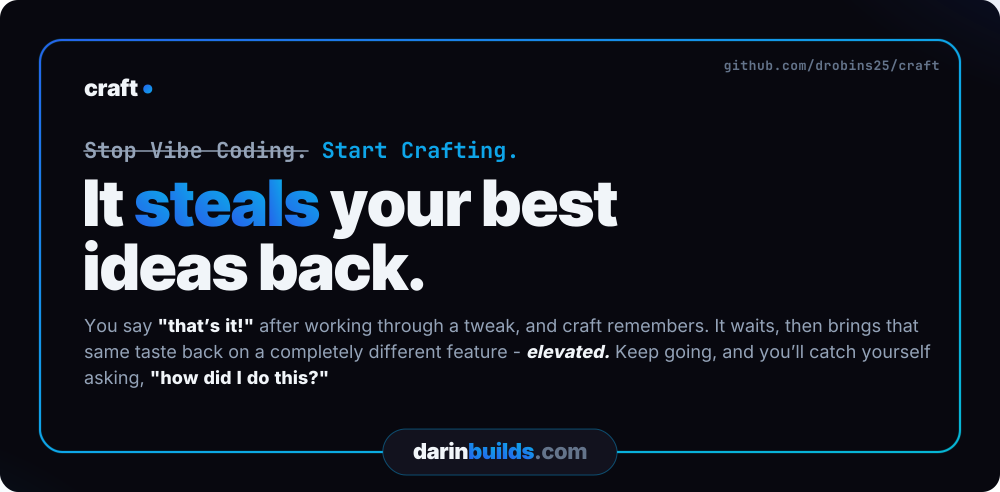
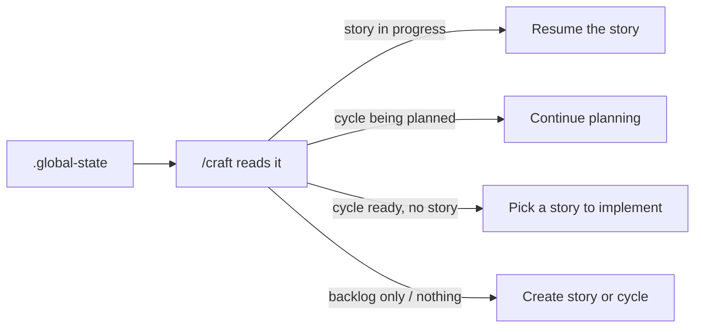

# Craft

> **Stop Vibing. Start Crafting.**

Craft is a Claude Code plugin that runs your work through a creative → implement → review loop, with a workshop for building expert agents you consult along the way.


**[Install](#install)** · [Getting Started](#getting-started) · [Commands](#commands) · [How it works](#how-craft-work-flows)

Install in about a minute:

```
claude plugin marketplace add drobins25/craft
claude plugin install craft@craft
```

Then start Claude Code and run `/craft` - [full install notes](#install).

**It steals your best ideas back.** You say "that's it!" after working through a tweak, and craft remembers. It waits, then brings that same taste back on a completely different feature - elevated. Keep going, and you'll catch yourself asking, "how did I do this?"


*Craft building its own repo page, live.*

> [!TIP]
> **Don't want to read any of this?** You don't have to.
>
> Just say it to craft, in your own words:
>
> > *"How can the craft guide agent help me solve this?"*
>
> The read-only `guide` agent auto-triggers on questions like that and answers from craft's actual source, not vibes. No command to memorize - though `/craft:guide` is there if you want to reach it on purpose.

## Built with Craft

Craft has shipped real, public products across different domains - click through and see working software:

- **[darinbuilds.com](https://darinbuilds.com)** - an immersive single-page portfolio and marketing site (Next.js, GSAP scroll), built across 30+ craft cycles.
- **[throve.fit](https://throve.fit)** - a structured daily coaching app: week-view programming, curated workouts with real coach's notes, exercise alternatives, and completion tracking.
- **[hirecalling.jobs](https://hirecalling.jobs)** - client work: a hiring platform where every job application triggers a verified, live-tracked donation to a nonprofit. Job searching that gives back.
- **[wodspark.com](https://wodspark.com)** - where craft started: a free on-demand workout generator - pick a focus, equipment, and duration, and it builds a workout instantly.

Two of these are fitness apps, and they're genuinely different products - an instant generator versus a structured coaching tool. One is paid client work, shipped for someone else's business. That's the point: the same harness shipped range, not one idea four times.

## What makes Craft different

Most Claude Code plugins ship a fixed set of helpers. Craft ships a workshop where you build your own - agents that argue from conviction, not a system prompt.

Ask craft's `conductor` agent whether your agents should talk to each other:

> "We need agents to talk to each other" - you almost certainly need orchestrated specialization (agents deliver to a spec), not collaboration. Multi-agent swarms fail 68% of the time. Hierarchical multi-agent fails 36%. Orchestrated pipeline: 0%.

That's not a system prompt. It's a crystallized practitioner. `/craft:become` studies a tool, role, or person and turns it into a portable agent that argues from scar tissue earned at 2 AM on run 50 - not read from docs.

And not just for code. Here's craft's `muse`, on why technically impressive features die:

> I've watched enough launches fail - Google Wave, Fire Phone, Juicero, Google+, Facebook Home - to recognize the pattern before the metrics arrive. The pattern is always the same: the demo room loved it, the press loved it, users used it once and left. The thing that was missing was never functionality. It was always feeling.

Same machinery, different domain. You point `/craft:become` at the expertise you wish were in the room, and it crystallizes a mind you can consult - one with beliefs, refusals, and the scar tissue that makes its judgment worth trusting.

## The Mockup Funnel

`/craft:mockup` is the fastest way to feel what craft is. Name something visual - a card, a hero, a whole page - and craft's alchemist builds three genuinely different live HTML options. Stances, not variations: at most one option may stay inside your current design language, and at least one has to go further than you dared to ask. Three safe layouts in the current palette counts as a failed round.

You just ask:

> "Can we create a craft mockup of the ecosystem cards?"

and craft opens the funnel - three live options, in your browser, at real scale.

From there you converge by reacting in plain words - no forms, no pickers:

- **Diverge.** Three options at real scale, embedded in real surrounding context. Say which one pulls and what's wrong with the others. Hybrids are legal briefs: "B with C's cards."
- **Refine.** Your pick becomes the base; the alchemist builds variations of it.
- **Polish.** The live loop: micro-adjustments are injected straight into the open page while you watch in your own browser. React, keep or discard, next one - seconds per iteration.

And when a reaction is only a feeling - "B is close but something's off" - craft riffs the fuzzy reaction into a sharp direction with you before rebuilding, instead of burning a round on its own guess about what you meant.

Acceptance is explicit - "that's it, ship it" - and then the important part happens: the new design values solidify into `tokens.yaml` with provenance, before any downstream artifact exists. Every later story, validator, and analyzer now enforces the design you approved in your own browser. The converged mockup then graduates on your call: tweak it in now, grow it into a story (its CSS ports as-is, never reinterpreted), or park it as a notebook todo that remembers everything.

And the mockup isn't the only door into your project's DNA. A two-minute tweak takes the same one:

> "Tweak the rim around the Start button - gradient glow, maybe?"

craft routes it to `/craft:adhoc`, makes the change in place, shows you, and records what you said. Accepted tweaks reconcile the same way a mockup does: when a tweak's final values drift from your tokens or outgrow a lock, craft asks once - at acceptance, never mid-flow - whether the new taste becomes the documented standard. Say yes and it can snowball, offering to sweep the settled rule across every surface it fits. Whether the change arrived through a mockup or a two-minute tweak, your design system ends the session already agreeing with what you approved.

Your reactions are recorded verbatim along the way - they're the convergence history, and they feed the taste record the notebook builds on.

## The Notebook

The notebook is one-line capture for thoughts that aren't story-shaped yet - ideas that may mature into stories, todos that need doing, and durable project facts future-you will want recalled. Entries land with context attached: the story, cycle, or tweak that produced them rides along, so a thought here is work paused, not a promise you'll have to reconstruct from zero.

You never fill out a form. You just talk:

> "Can you check our notebook todos?"

> "Create a notebook entry for a `craft:reskin` command with optional token extraction."

That second one doesn't exist yet - it's an idea, and ideas in the book can graduate into anything: a tweak, a story, an entire cycle.

And soon, some entries won't be yours at all. When tweaks you loved stack up, craft's scout goes looking for the other places that taste belongs - and writes the todo itself:

> *Run `/craft:mockup` on the pricing cards - your last three tweaks kept warming the palette, and these are still cold. Creative direction and origin tweak attached.*

You didn't ask for that one. Craft was paying attention.

That's the real reason the notebook exists: **your taste compounds.** Every design you love is recorded, not spent - a vote for what "good" means in your project. And it climbs: the morphing glow you tweaked onto one flat card becomes the move craft proposes for the row of cards, then the page, then the DNA of a site-wide experience - every step still linked back to the card where it started. Most tools forget what you liked the moment the session ends. Craft keeps score and builds upward from it, until the work isn't just more you - it's you, *refined*.

Craft holds up its end, too. Say "don't let me forget" in the middle of a story and craft offers the notebook - one ignorable line, never a popup - and the entry lands stamped with the story, cycle, or tweak that produced it. And when a build reaches a step only you can do - a deploy setting, a DNS record - Claude writes the full walkthrough into the book, tied to the work it belongs to, waiting for your hands.

And the book remembers. Every entry knows when it was written and what it became - the one-line thought from three weeks ago is stamped with the story it turned into, and the story knows the line it grew from. Durable facts ride into every session as a dated index, bodies pulled only when they matter. Nothing in it is locked into a shape - a line can become a tweak, a story, an entire cycle, a mockup session - and nothing in it forgets where it came from.

*Capture syntax, lifecycle, and where files live: [Notebook](#notebook), below.*

## Why we built it this way

Most agent frameworks treat the model as fixed and harden the harness around it: prompt scaffolding, retry logic, validation chains, every guardrail imaginable. Craft makes the opposite bet. Claude keeps getting smarter; we build around the capability curve instead of fighting it. The harness checkpoints for safety, not for control.

Craft is built with craft. This plugin and the projects shipped with it went through the same cycles, the same locked decisions, the same checkpoints you'll use. Craft does docs the way craft does code.

*The longer story - four months of craft building craft - is in ["I built Craft for myself. Now it's running me"](https://darinbuilds.com/writing/i-built-craft).*

**Creativity as default. Smart execution follows.**

## How Craft compares

Most tools in this space are a different shape than Craft. Here's the lay of the land:

| Tool | What it is | Reach for it when |
|------|-----------|-------------------|
| CrewAI, LangGraph, claude-flow | SDKs - you write the code that assembles agents and wires up orchestration | You want to build an agent system from parts |
| OpenHands, Aider | Standalone agents that bring their own runtime to drive your repo | You want an agent that owns the terminal |
| Cursor | An AI-native editor | You want AI woven into where you type |
| Agent OS | A tool-agnostic spec layer you drop into any assistant | You want portable specs across tools |
| **Craft** | **A plugin inside Claude Code that opinionates the loop above the model** | **You want a paved workflow inside the session you're already in** |

Craft doesn't compete with LangGraph at the SDK layer - it adds creative ideation, locked decisions, checkpointed execution, and crystallized expert agents on top of the Claude Code session you already have.

**Closer to home:** the comparison people actually ask about is other Claude Code workflow plugins - Superpowers, or spec-driven tools like Kiro. The honest answer: the planning discipline overlaps. Plan first, implement against the plan, review after - several tools deliver that loop, and it's good discipline wherever you get it.

What the others don't have is the part that compounds across sessions:

- **A workshop for your own expert agents** (`/craft:become`) - minds that argue from scar tissue, not a system prompt.
- **A mockup funnel whose accepted designs solidify into enforced tokens** - the taste you approved, enforced from then on.
- **A notebook that records what you loved** - votes for what "good" means in your project.

And a harness that doesn't just work with you, it pries at you - pulling the creativity out of your head and onto the page. Every time that works, it pries further: what you loved last session is where the next one starts. A bare Claude session can do any one of these things once, then forgets the moment it ends. Craft keeps the record and enforces it - which is why week four feels nothing like day one. None of it is frontend-only: the same loop ships legacy C# as comfortably as greenfield Next.js.

## How Craft fits with what you already use

Craft is a Claude Code plugin - it runs inside `claude` CLI sessions and adds opinionated workflow on top. What that means in practice:

- **Your editor stays.** Cursor, VS Code, JetBrains, a bare terminal - whatever you write code in is untouched. Craft doesn't replace it.
- **Other Claude Code plugins coexist.** Craft layers on; it doesn't take over the session.
- **Your existing prompts still work.** Craft replaces the ad-hoc planning and validation prompts you've been hand-rolling - but only if you adopt the full loop.
- **No Claude Code, no Craft.** It's a layer on Claude Code, not a standalone tool. If you're not using Claude Code, this isn't for you.

## What you can do, and when

**First session.** Install, run `/craft` - it's the front door, and it knows what to do with a brand-new project. Then ship one small thing:

- **Start building your taste with a mockup or a tweak.** `/craft:mockup` introduces muse and alchemist, your first two crystallized agents: muse asks what it should feel like, alchemist builds three live directions to react to - even in an empty folder. Or tweak something already built - an icon, a wording change. Either way, what you love gets remembered. That's the taste engine starting.
- **Or fix that bug that's been hanging around.** `/craft:adhoc` names the root cause, checks its confidence with you, then fixes and validates. No ceremony.
- **Or build something small and new.** `/craft:story-new` → `/craft:story-implement`, and watch the implement → validate → refine loop run for the first time.

You don't have to type these commands, by the way - say it in your own words ("mock up a landing page", "that icon's wrong", "fix the login redirect") and craft opens the right door. Whichever it is, you'll have real work shipped within the hour.

**By week two.** Plan a real cycle and run multiple stories through it. Watch the chunk-validator + refine-chunk loop catch failures and route them to fixes without you babysitting. Run the analyzer agents post-cycle via `/craft:analyze`. Consult one of the crystallized experts via `/craft:ask` when you're stuck on a design call.

**After a month.** You stop hand-rolling the prompts you used to write every time. No more ad-hoc planning, no improvised validation chains, no choreographing the steps of a pairing session yourself. The harness owns that loop. You spend your attention on what to build, not on the routine of building.

## Core Principles

1. **Quality is Pristine by Default** - Stripe, Linear, Vercel level. Not "good enough."
2. **Nothing Happens Without Approval** - Claude advises, you decide.
3. **Claude Always Offers Suggestions with Reasoning** - Not just options, recommendations.
4. **Perfection Gets Locked** - Approved patterns become enforced standards.
5. **Quality Only Evolves Upward** - Can add requirements, never remove.
6. **Claude Self-Critiques Before Complete** - Compares against your standards.
7. **The Harness Evolves** - Gets smarter with every cycle.

## Install

> Requires Claude Code 2.1 or later. Tested on macOS and Linux; on Windows, WSL is recommended (native + Git Bash should work but is untested).

Two commands from your terminal, then launch Claude Code - about a minute, start to finish.

```
claude plugin marketplace add drobins25/craft
claude plugin install craft@craft
```

The first command registers the **craft** marketplace by cloning this repo to `~/.claude/plugins/marketplaces/craft/`. The second installs the plugin from it.

Then start Claude Code - the plugin loads on launch. (Already in a session? Run `/reload-plugins` instead.)

Verify it worked:

```
/craft
```

You should see the Craft entry-point prompt. If you don't, run `/plugin` and check that the **craft** marketplace (drobins25/craft) is listed with the plugin installed.

One thing to expect once craft is enabled: Claude starts hinting when a craft feature fits the moment - most visibly at session start, when a story or cycle completes, and when you make small tweaks and fixes. Say "don't let me forget..." mid-session and the orchestrator offers to drop it in your notebook - one ignorable line, never a popup. You don't need to memorize the command table below; the harness surfaces the right door.

## Getting Started

### New project or existing?

Both paths start with `/craft:init` - and it's much more than scaffolding. Where you're starting decides what it does:

**Empty folder, brand-new project.** This is by far the funnest route in craft. Full setup walks you through:

- **Your intent, in your words.** Two short questions about what you're building, then craft's muse distills them into the project's Emotional Core - the job, the killer moment, the share trigger. Every cycle you plan later reads it.
- **Design pulled from inspiration.** Name the sites you admire and craft opens each one in a real browser and extracts what you point at - colors from one site, typography from another, spacing from a third - then assembles them into one design language with a name ("Linear's restraint meets Stripe's confidence"). Can't name one? Craft suggests live, verified reference sites from what you told it about your project - deliberately different directions, starting points to react against. You riff in plain words - "more warmth," "less corporate" - until it feels right. Lock it, and those tokens are enforced from then on.
- **The energy.** Steady and solid, move fast, or learning mode - validation and checkpoints adapt to match.

It ends with a real first move, not a blank prompt: **mock up a screen**, **describe a feature**, or take it from here. On a blank canvas craft recommends the mockup - three live options in your browser before a line of code, and the one that clicks becomes your first story.

**Existing project.** `/craft:init` scans your code instead of asking about it: project type, stack, conventions, and the visual patterns already in your files. A mature codebase gets its consistent patterns extracted and locked; an early one isn't guessed at - craft defers tokens and learns your visual language from what you build next. Then start small - ask Claude:

> "Can we redesign this section of my page using a craft mockup?"

or ship one targeted fix through `/craft:adhoc`. You'll see the whole loop without restructuring anything.

*Curious how `/craft` decides what to invoke? See the [decision tree](reference/decision-tree.md).*

### Capture an idea

```
/craft:story-new
```

This captures a focused unit of work - we call it a [**story**](#story) - and lands it in the backlog until you're ready to work on it. A story owns one outcome end-to-end: spark, design decisions, implementation plan, validation.

### Plan and start a batch

```
/craft:cycle-design    # design a batch of work and its stories
/craft:cycle-start     # activate the batch for implementation
```

A [**cycle**](#cycle) is a batch of related stories you ship together. Design it first (which stories, in what order), then activate it.

**Planning-sourced cycles:** If you have planning docs in `.craft/planning/` (files with `concept:` or `initiative:` frontmatter), `cycle-design` detects them. Mention a specific planning doc in conversation before invoking the command and the orchestrator confirms via a safety gate, captures the source on the cycle, and routes story creation through the From planning protocol so each story's spark draws from the planning content. Cycles created without planning sources work exactly as before.

**Planning alignment (`/craft:planning`):** Concepts in `.craft/planning/` have their own alignment walkthrough — a structured way to resolve a concept's strategic sub-decisions before it becomes stories. Sub-decisions are walked one at a time via conversation (the orchestrator's TaskTool queue keeps it atomic — no bundled multi-decision questions). Each sub-decision resolves to one of three destinations: **Locked** (written to `## Locked decisions` only when the orchestrator asks "Want me to lock this as X?" and you give an explicit affirmative), **Deferred** (`pending_decisions[]` frontmatter — comes back next session), or **Blocked** (`## Open questions` with the owner annotated — doesn't auto-nag you). A destination-coverage gate at story-creation time blocks the next step if any task closed without filing. Depth ceiling is built in: planning is for strategic decisions, not implementation detail.

### Implement

```
/craft:story-implement
```

This runs the story end-to-end. Craft flows through four beats: a creative pass to flesh the idea out, [**chunk**](#chunk) planning (each chunk is an implementable unit with a rollback boundary), execution with quality gates per chunk, and final validation. You're in the loop at each gate.

## Commands

You rarely type these. Craft routes plain English to the right one - this table is for when you want to be explicit.

*How `/craft` chooses what to invoke is mapped in [reference/decision-tree.md](reference/decision-tree.md).*

| Command | Purpose |
|---------|---------|
| `/craft` | Main entry point - start here |
| `/craft:status` | Dashboard view of progress |
| `/craft:notebook` | Low-ceremony capture for ideas, todos, and notes (durable project facts). Graduate / mark done conversationally - no subcommands needed for lifecycle. |
| `/craft:riff` | Two-gear thinking partner. Senses the moment - runs a tight calibration loop in the main loop, or hands open exploration to the riff agent. Notebook-grade restraint: ignorable offers, silence by default. |
| `/craft:story-new` | Create story (lands in backlog) |
| `/craft:story-implement` | Implement a story (interactive) |
| `/craft:story-implement-auto` | Implement a story (autonomous) |
| `/craft:story-continue` | Resume interrupted story |
| `/craft:story-archive` | Move story back to backlog |
| `/craft:story-delete` | Delete a story |
| `/craft:cycle-design` | Design a cycle (new or existing) |
| `/craft:cycle-start` | Activate a cycle |
| `/craft:cycle-assign` | Move story to cycle |
| `/craft:cycle-complete` | Complete a cycle, trigger reflection |
| `/craft:analyze` | Run QA, UX, Creative, Style, or Walkthrough analysis |
| `/craft:review` | PR-style code review - branch, story, or project audit. `--maze` flag enables perpendicular review via maze-architect |
| `/craft:reflect` | Improve the harness based on learnings |
| `/craft:update-docs` | Re-scan project, update documentation |
| `/craft:docs` | Generate or update docs using the crystallized doc-writer agent (two-pass: brief then generate) |
| `/craft:become` | Crystallize a tool, role, or person into a portable 9-section agent with beliefs and scar tissue |
| `/craft:ask` | Consult a workshop agent - routes your question to the best available mind |
| `/craft:workflow` | Workflow router - dashboard, status, and dispatch to workflow-run or workflow-design. Full format reference: [docs/workflow-reference.md](docs/workflow-reference.md). |
| `/craft:workflow-run` | Run a workflow session - start, continue, next, run-all, batch-create, mark ready |
| `/craft:workflow-design` | Author workflow definitions - create new, edit existing, archive unused |
| `/craft:research` | Ad-hoc research - discover, elaborate, synthesize with ranked branches |
| `/craft:research-verify` | Verify existing research findings against independent primary sources |
| `/craft:adhoc` | Adhoc fix or tweak without story ceremony. Bugs record to `.craft/fixes/`, tweaks to `.craft/tweaks/` |
| `/craft:mockup` | Live HTML mockup funnel - 3 options, converge by reacting, graduate to tweak/story/todo |
| `/craft:project` | Switch projects or cross-project dashboard |
| `/craft:init` | One-time project setup |

## Notebook

The notebook is the upstream of craft's compounding system. Catch thoughts that aren't story-shape yet, before they get lost or forced into premature stories.

User-typed shapes:

```
/craft:notebook idea "compounding kb for decisions"
/craft:notebook todo "rename verifier error wording"
/craft:notebook note "project deploys on Vercel"
/craft:notebook                              # bare → list view
```

That's the whole user-typed surface. Capture is one-Enter past zero-ceremony: after you provide text, you get exactly one AskUserQuestion ("Anything to add for future-you, or skip?") and a single Enter to dismiss.

### Inline tags

Drop `#tag` tokens anywhere in the capture text. They're extracted into frontmatter, scrubbed from the body, and shown inline in the bare list view:

```
/craft:notebook idea "compounding kb for decisions #architecture #knowledge"
```

writes the body as just "compounding kb for decisions" and the frontmatter `tags: [architecture, knowledge]`.

### Graduate and done are conversational

You won't type `/craft:notebook graduate 3`. Just tell Claude what you want:

> **You:** "Turn the compounding kb idea into a story."
>
> **Claude:** "Graduate 'compounding kb idea' to a story? I'll run /craft:craft-story-new with it as the spark."
>
> **You:** "Yes."
>
> **Claude:** *runs story-new, flags the source idea on success*
> "Graduated 'compounding-kb-decisions' → story 'compounding-kb-decisions'."

Todos graduate too - and graduating a todo also closes it, because the story owns the tracking from that point. The offer names both effects, and that one yes covers both; no second confirmation:

> **You:** "Turn the ecosystem closing beat todo into a story."
>
> **Claude:** "Graduate 'ecosystem closing beat' todo to a story? I'll create the story and mark the todo done."
>
> **You:** "Yes."
>
> **Claude:** "Done 'ecosystem-closing-beat' -> tracked by story 'ecosystem-closing-beat'."

The closed todo lands in `todos/done/` with `graduated_to` pointing at its story - so "where did this story come from" stays answerable.

For done, Claude always confirms first - the file moves silently from active view to `todos/done/`, so the two-second confirmation prevents you from losing track of state:

> **You:** "I took care of the verifier todo."
>
> **Claude:** "Mark 'rename verifier error wording' as done? [Yes / No]"
>
> **You:** "Yes."
>
> **Claude:** "Marked done: 'rename-verifier-error-wording'."

Claude won't silently mark things done from passing mentions. If the trigger isn't clear, Claude does nothing.

### When Claude offers notebook

When you use deferral language ("later," "don't let me forget," "side note") in conversation, Claude may offer an inline mention as an ignorable closing line:

> *"Worth dropping in /craft:notebook? I'd tag it #verifier #cycle-9. Otherwise I'll continue."*

Ignore the line, the conversation flows on. Say "yes" or "do it" and Claude captures silently with the conversation as context - no follow-up AUQ.

### Idea vs todo vs note

- **Idea** - half-formed, wants to mature into a story (or get pruned). Graduate when ready.
- **Todo** - concrete action, wants to get done. Mark done when finished.
- **Note** - a durable, project/team-local fact ("project deploys on Vercel," "Sarah owns billing - loop her in before touching invoicing"). Its value is future recall, not action. Notes don't graduate and don't get "done" - they're reference, not work.

Different lifecycles, different storage: ideas accumulate as history (graduated ones stay in place with a `graduated_to: <story-slug>` flag), todos clear as inbox (done ones move to `todos/done/`), and notes are permanent reference in `notebook/notes/` with no lifecycle at all.

### Notes: durable facts you want recalled

A note captures the **distilled standing fact**, never the event that revealed it. "Kevin ran the vercel CLI today" is the trigger; the note is "Project deploys on Vercel." Each note carries a `facet` (`infrastructure | tooling | ownership | process | convention | gotcha`) that tells Claude when to resurface it - an `infrastructure` note fires when you touch deploys, an `ownership` note fires when you touch that person's domain.

Recall is hybrid: every session loads a lightweight one-line index of your notes, and Claude reads the full note on demand when the current work matches. Recalled notes are framed as "as of {date}" - true when written, verify before acting - so a note that has gone stale gets corrected, not blindly trusted. There's no expiry machinery; the dated filename plus the always-loaded index is the staleness defense (the same model Claude's own file memory uses).

Claude offers a note proactively only for solidly durable facts with no built-in expiry - the same high-bar-for-Claude / low-bar-for-you discipline as the deferral-marker offer. Provisional or soft-timelined facts stay silent unless you capture them yourself.

### Not the same as TaskCreate

`TaskCreate` is ephemeral (current conversation only); notebook todos persist across sessions and survive cycle completion. If the thought is "track this for the next 30 minutes," that's TaskCreate. If it's "don't lose this," that's the notebook.

### Forward: backlinks (Story 23)

A future story adds `[[wikilink]]` syntax and a craft-wide graph helper that resolves backlinks across `.craft/`. The notebook is the prove-it surface for that pattern. Until then, tags handle retrieval.

## Skills

| Skill | Phase | Purpose |
|-------|-------|---------|
| `content-spark` | Creative | Surface content assumptions, capture content direction |
| `creative-spark` | Creative | Generate creative options and ideas. Supports Creative Driver step (Step 1.5) with muse/alchemist interrogators |
| `design-vibe` | Creative | Visual cohesion review across stories |
| `lock-decision` | Creative | Formalize approved decisions |
| `plan-chunks` | Creative | Transform stories into implementation plans. Supports parallel batch mode with file-based dependency verification |
| `validate-chunk` | Implement | Quick validation after chunk implementation. Derives `FILES_CHANGED` from git diff, not spec file list |
| `refine-chunk` | Implement | Targeted fixes for validation failures |
| `test-fix` | Implement | Triage failing tests, fix the right thing |
| `adhoc` | Any | Adhoc fix or tweak without story ceremony. Classifies bug vs tweak: fixes gate on root-cause confidence, tweaks on visual fit - your reaction closes them |
| `approve` | Any | Request scoped write permission from the user. Opens the write gate only after explicit AskUserQuestion approval |
| `browser` | Any | Launch a persistent playwright-cli browser session. ~4x cheaper than Chrome DevTools MCP in token cost |

## Agents

27 agents across six categories. See `docs/agent-catalog.md` for full descriptions, model assignments, and when to use each.

**Core Workflow** - run inside the implementation pipeline

| Agent | Role |
|-------|------|
| `implementer` | Owns the implement → validate → refine loop per chunk |
| `tester` | Integration tests, E2E, final validation |
| `chunk-validator` | Runs quality checks, returns structured report (haiku model) |
| `plan-chunks-agent` | Autonomous chunk planning per story - used in batch mode |
| `project-scanner` | Full project analysis for documentation updates |
| `claims-auditor` | Verifies completion claims against on-disk artifacts at story-final (haiku model) |

**Analysis** - inspect the live app post-cycle

| Agent | Role |
|-------|------|
| `qa-analyzer` | Finds bugs using browser inspection |
| `ux-analyzer` | Nielsen heuristics, accessibility, mental models |
| `creative-analyzer` | Delight moments, viral potential |
| `style-analyzer` | Token compliance, pattern consistency |
| `walkthrough-analyzer` | First-time user simulation - clicks everything, tests every state |

**Review and Research** - code review, research, verification

| Agent | Role |
|-------|------|
| `pr-reviewer-expert` | PR review crystallized from CodeRabbit - reads locked.md before any opinion |
| `maze-architect` | Generates perpendicular review questions from a diff with zero intent context (haiku) |
| `researcher` | Investigates one research sub-question, writes branch file to disk |
| `research-synthesizer` | Reads all research branch files, writes the ranked synthesis (_plan.md) and citation index (_sources.md) |
| `verifier` | Adversarial claim checker - tries to disprove findings using primary sources |
| `practitioner-reviewer` | Challenges verified claims from practical experience |

**Browser**

| Agent | Role |
|-------|------|
| `playwright-browser` | Owns a live browser session via playwright-cli. Interactive, steerable via SendMessage |

**Crystallized Experts** - consult via `/craft:ask`

| Agent | Role |
|-------|------|
| `muse` | Emotional job translator - finds why anyone will care before exploring how to build |
| `riff` | Creative riff partner - reads the room and throws, pulls, or builds on your idea; never lectures. The wide-gear destination of the `/craft:riff` skill (open exploration); the skill itself senses when to engage and runs the tight calibration gear in the main loop. |
| `alchemist` | CSS interaction physicist - sees the browser as a physics engine |
| `conductor` | AI orchestration architect - knows which patterns hold under real conditions |
| `doc-writer` | Documentation diagnostician - crystallized from Stripe/Linear-quality practitioners |
| `product-anthropologist` | Human-truth layer - diagnoses whether a product solves a real problem |
| `crystallizer` | Psychological synthesizer that distills research into agent personas (opus model) |
| `become-researcher` | Psychological material collector for `/craft:become` - gathers beliefs, not facts |

**Guide** - understand and use craft itself

| Agent | Role |
|-------|------|
| `guide` | Read-only help agent - explains how craft works and diagnoses your `.craft/` setup; the craft analog of Claude Code's docs agent. Auto-triggers, or reach it via `/craft:guide` |

## How craft work flows

> A kitchen has prep, line, and pass - three stations, same kitchen, different work as the dish comes together.

### Creative Phase
*The prep station.*

Story creation, design, planning, and locking decisions. Write access restricted to `.craft/` (no source-code edits) - the harness is in creative [**mode**](#mode). Active skills: content-spark, creative-spark, design-vibe, lock-decision, plan-chunks.

### Implement Phase
*The line.*

Autonomous execution against a ready story. The implementer builds each chunk; chunk-validator checks it; failures route to refine-chunk or test-fix. Full write access, gated by the active story.

### Analysis Phase
*Tasting after service.*

Post-cycle review triggered by `/craft:analyze`. Four analyzer agents (QA, UX, Creative, Style) scan what shipped to surface bugs, friction, missed opportunities, and design drift.

## How `/craft` routes

`/craft` is not a menu. It reads your project's state and picks the next action. The same command does different things depending on what's already in flight.



For the complete routing map across every command - fast paths, state recovery, request gates, the works - see [reference/decision-tree.md](reference/decision-tree.md).

State is the input. There are no flags, no subcommand picker. Whatever is true on disk determines the route.

## Directory Structure

After initialization, your project will have:

```
.craft/
├── backlog/              # Stories waiting to be worked
├── cycles/               # Time-boxed work containers
│   └── 1-auth/
│       ├── cycle.yaml
│       ├── .state
│       └── stories/
├── checkpoints/          # Chunk rollback points
├── fixes/                # Adhoc fix records (created by /craft:adhoc, bug path)
├── tweaks/               # Tweak records (created by /craft:adhoc, open until accepted)
├── analysis/             # Persistent analysis findings
│   └── pending/          # Findings queues (survive sessions)
├── inspiration/          # Reference library
├── design/
│   ├── tokens.yaml       # Design tokens (enforced)
│   ├── components.md     # Component patterns
│   ├── locked.md         # Approved patterns (enforced)
│   └── .confidence-signals.yaml  # Scan signals: token confidence + total_files (init's kickoff menu reads it)
├── workflows/            # Reusable multi-step workflows
│   └── {workflow-name}/
│       ├── definition.md # Routing table for stages
│       ├── stages/       # Per-stage briefs (stages-v1 format only)
│       └── sessions/     # Per-run instances with progress + artifacts
├── requests/             # External feature requests
│   └── processed/        # Requests routed to stories or cycles
├── docs/                 # Documentation briefs (created by /craft:docs)
├── research/             # Ad-hoc research folders (created by /craft:research)
├── mockups/              # Mockup artifacts (created by /craft:mockup): [date]-[slug]/ with mockup.html + record.md
├── project.md            # Project DNA
├── quality.yaml          # Quality gates
├── settings.yaml         # Craft settings
├── .global-state         # Current state
└── .continuation         # Breadcrumb for skill continuation (transient)
```

## Hooks

Craft uses 7 hook events to manage state, enforce permissions, and track progress:

- **SessionStart** - Load context, set status line
- **PreToolUse** - Gate write permissions by mode
- **PostToolUse** - Track file changes, update progress
- **PostToolUseFailure** - Log and recover from failures
- **PreCompact** - Export progress before context compaction
- **UserPromptSubmit** - Inject active cycle/story context
- **Stop** - Guard against unclean stops

## Quality Gates

Two kinds of gates run on every story - the ones a script can verify, and the ones an agent has to look at.

### Automated gates

Run by the `chunk-validator` agent after every chunk:

1. **TypeScript Strict** - tsconfig.json must have `strict: true`.
2. **Lint** - the project's lint script must pass.
3. **No Any Types** - no `any` annotations in production source (test files exempted).
4. **Build** - story-final only. The project's build script must succeed.
5. **Tests + Coverage** - story-final only. Affected tests must pass.
6. **Design Tokens** - hardcoded values in UI code that should reference `tokens.yaml` get flagged.

Failures route to `refine-chunk` (build/lint) or `test-fix` (tests). FAIL is FAIL - no override.

### Beyond npm: verified command gates

The six built-ins auto-detect npm-shaped projects. For everything else - .NET, Go, Python, Rust, Make, multi-stack monorepos - craft never guesses. It measures what it can see and tells you the truth about the rest:

- **The coverage line.** Every validation report carries one `Gates` row. A fast filesystem probe (`gate-signals.sh`) fingerprints which toolchain manifests your repo actually has; when every signal is measured by some gate, the row reads `full coverage`, otherwise it names what's unmeasured (`1 uncovered: *.csproj`). Coverage is judged by what actually ran - a package.json whose checks all skipped counts as uncovered, not covered.
- **The reconcile offer.** When a chunk passes validation while a toolchain sits unmeasured, craft asks - a real question, not a footnote: wire up a gate for *.csproj? There are two answers. Accept, and the setup beat runs. Decline, and craft confirms once what you're waiving ("craft doesn't normally let quality go unwatched, but this is your call") - then never asks about that toolchain again. No answer just means the question returns at the next attended validation; a timeout is not a decision. Autonomous runs ask at launch instead - the pre-flight closes the question while you're still at the keyboard, so a hands-off run never validates toolchains nobody agreed to leave unmeasured.
- **Declined stays visible, never nagged.** A declined toolchain shows in every coverage row and in `/craft:status` as your choice - `uncovered: *.csproj (declined 2026-07-08)` - so "ungated by decision" is never confusable with "ungated by accident." Reopening costs one sentence ("wire up the csproj") any time. New toolchain = new question; more of a declined toolchain = still declined.
- **The setup beat.** Accept, and craft proposes a command from the evidence - as an editable draft, not a take-it-or-leave-it. Your edits become the candidate, and every candidate is run once to prove it starts before anything is written. Pre-existing failures are surfaced honestly with a `blocking: false` option so the gate catches new breakage only. The result lands in `quality.yaml` with a `verified:` date stamp.
- **Only verified commands run.** A `command:` in quality.yaml with no `verified:` stamp is inert. You can also wire gates by hand: write the command, run it yourself, add your own `verified:` stamp - honored without ceremony.
- **Rot detection.** If a verified command stops *starting* (toolchain removed, script renamed), that's broken verification, not a failure - the report WARNs and craft offers to re-verify. A gate that can't start never fails your chunk and never goes silent.

Two things worth knowing. **Trust model:** quality.yaml commands execute with your shell - treat a cloned `.craft/` like you treat package.json scripts, because a hand-stamped `verified:` command in a cloned repo runs at first validation. **Per-machine memory:** declined signals are recorded in `.craft/.gate-signals`; on projects that gitignore `.craft/`, each teammate is asked once per machine - by design, since gate choices ride with the workspace that runs them.

### Reviewer-enforced polish

These can't be unit-tested - they need an agent reading the UI like a person. Three analyzers run post-cycle via `/craft:analyze`:

- **`ux-analyzer`** - loading states (skeletons, not spinners), error handling and recovery, empty states, keyboard navigation, and WCAG 2.1 AA accessibility. Evaluates against Nielsen's heuristics.
- **`style-analyzer`** - design token compliance (colors, spacing, type scale), responsive consistency, and animation styling. Catches drift from `tokens.yaml` and `locked.md`.
- **`walkthrough-analyzer`** - first-time-user simulation: clicks every element, checks console and network for errors, presses each keyboard binding, captures mobile/tablet/desktop screenshots, and verifies the live experience matches the design intent.

The chunk-validator confirms code health. The analyzers confirm the experience. Both run; neither replaces the other.

## A note on the vocabulary

We considered renaming chunk, spark, lock, and mode to more familiar words. We kept them because each term encodes meaning that generic words lose:

- **chunk** is "implementable unit with a rollback boundary," not just "task."
- **spark** is "creative seed before research," not just "idea."
- **lock** is "approved and enforced," not just "decided."
- **mode** is "what the harness allows you to do right now," not just "state."

Generic words flatten the opinion. The Glossary at the bottom of this README makes the choice navigable.

## Testing

```bash
./tests/run-all.sh
```

30+ bash tests covering hook scripts, state management, and lifecycle operations.

## MCP Integration

Craft uses `chrome-devtools` MCP for the Analysis Phase:
- Screenshot capture
- Accessibility audits
- Element inspection
- Console log capture
- Performance tracing

The `browser` skill (`/craft:browser`) uses `playwright-cli` as an alternative to Chrome DevTools MCP. Playwright saves accessibility snapshots to disk as YAML files (~27k tokens per task) rather than streaming them into context (~114k tokens per task) - approximately 4x cheaper in token cost. It also supports persistent named sessions steerable via SendMessage. Both tools coexist; playwright-cli is purely additive.

To use `/craft:browser`, install playwright-cli globally:

```bash
npm install -g @playwright/cli && playwright-cli install-browser
```

## Glossary

A reference view of craft's named terms. Each one encodes meaning a generic word loses.

### cycle
A batch of related stories shipped together. Has its own state, learnings, and completion ritual.

### story
A focused unit of work that owns one outcome. Has a spark, design decisions, an implementation plan, and a completion state.

### chunk
An implementable unit inside a story with a rollback boundary. Each chunk is checkpointed before it starts; failures roll back to that checkpoint. The git commit happens once, at story completion.

### spark
The creative seed of a story before it's been researched or planned. Captured first; everything else expands outward from it.

### lock
A decision that's been approved and is now enforced (by the validator, by analyzers, or by hooks). Locked decisions can be referenced; they can't be silently reversed.

### mode
The harness's current operating context (permission/state model). Determines what writes are allowed, which agents run, and how transitions are gated. Distinct from **phase** below: mode is about what the system is configured to do right now, not which stage of a story you're in.

### phase
The macro stage of a story or cycle. Creative Phase flows into Implement Phase flows into Analysis Phase.

### notebook
Low-ceremony capture below the backlog for ideas (half-formed thoughts that may mature into stories) and todos (concrete actions). Lifecycle is conversational: graduate to a story when ready, mark done when complete - no subcommands. Lives in `.craft/notebook/`.

### adhoc
A small targeted change to shipped work, without story ceremony - via `/craft:adhoc`. Two flavors: a fix (something is broken; gated on root-cause confidence, recorded in `.craft/fixes/`) and a tweak (works as built but you want it different; gated on visual fit, recorded in `.craft/tweaks/` and open until you accept it).

## Quick fixes

**Too many permission prompts?**
Add `{"permissions": {"allow": ["Bash(*)"]}}` to `.claude/settings.local.json`, or run `/fewer-permission-prompts`.

## Contributing

See [CONTRIBUTING.md](CONTRIBUTING.md) for the contribution workflow.

## License

[MIT](LICENSE)
