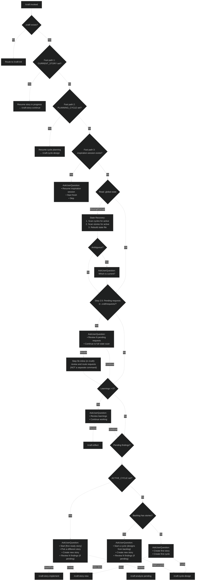
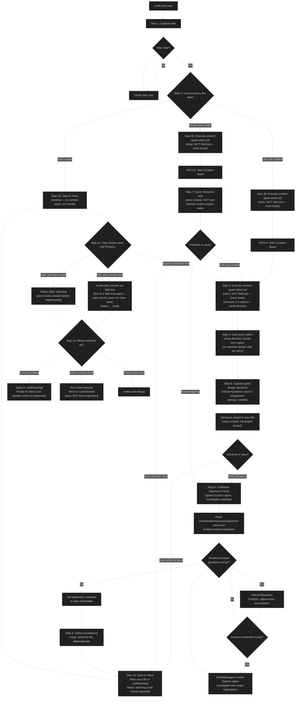
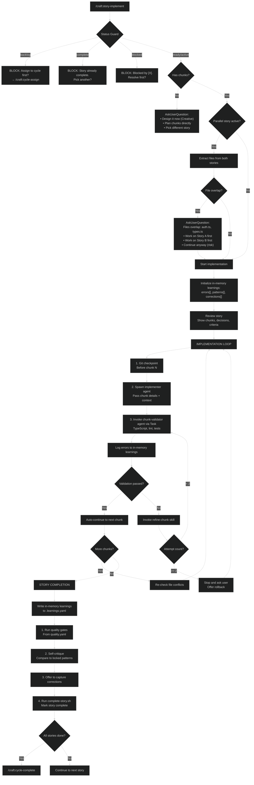
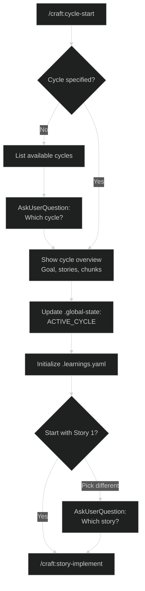
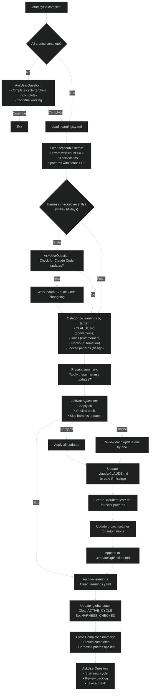
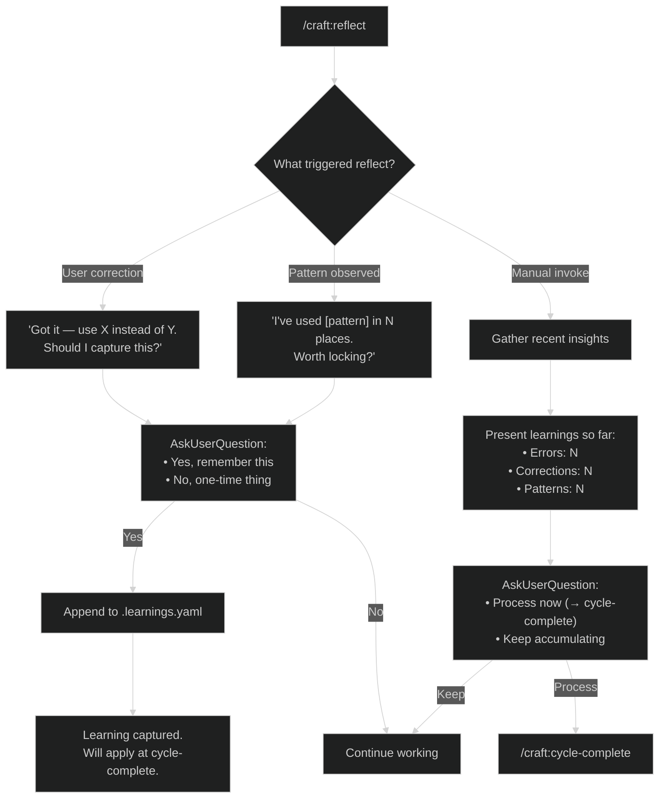
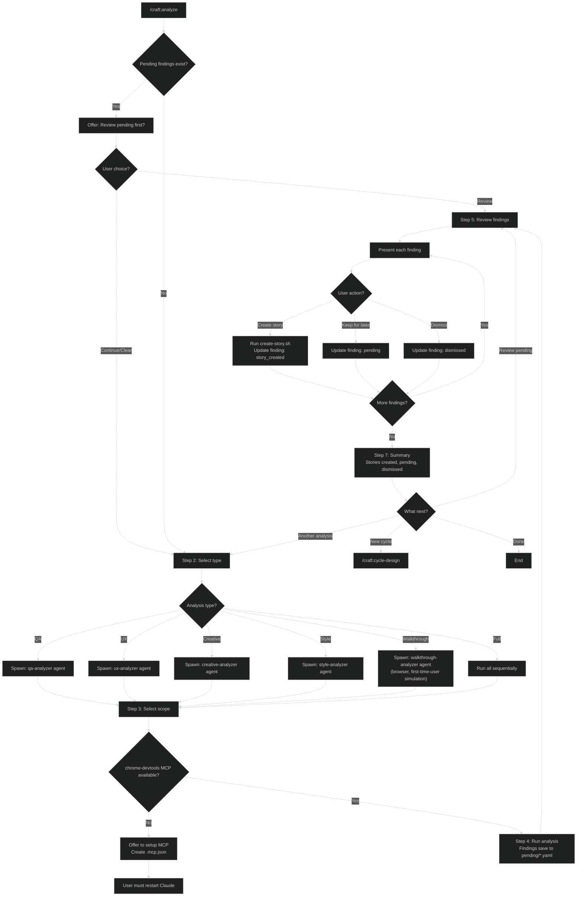
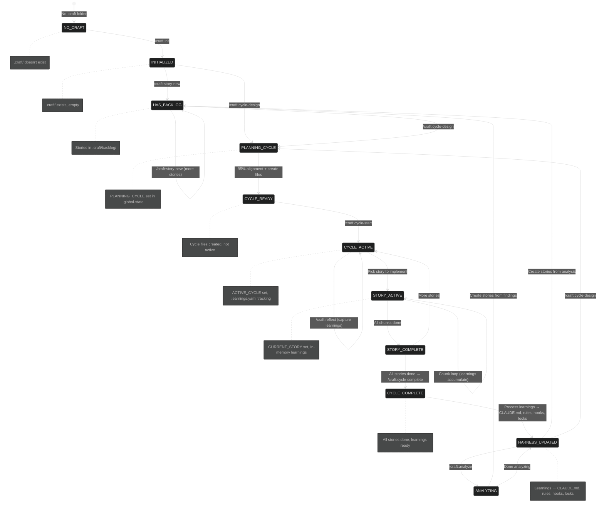
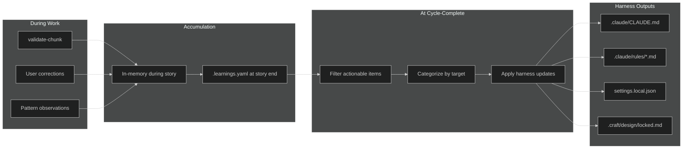

# Craft Plugin Decision Tree

This document maps the complete routing logic from the `/craft` entry point based on the state of the `.craft` folder.

## Main Entry Point: `/craft`



---

## Story Creation Flow: `/craft:story-new`



---

## Story Implementation Flow: `/craft:story-implement`



---

## Cycle Creation Flow: `/craft:cycle-design`

```mermaid
%%{init: {'theme': 'dark'}}%%
flowchart TD
    CYCLE_DESIGN["/craft:cycle-design"] --> MODE_DISPATCH{"Mode dispatch<br/>(args provided?)"}

    MODE_DISPATCH -->|"Args = existing PLANNING cycle"| DETAILING["Read references/cycle-design/<br/>detailing-mode.md<br/>(Resume + flesh out unfinished cycle)"]
    MODE_DISPATCH -->|"Args = ready/active/complete cycle"| ERR["Error: cycle not in planning.<br/>Use /craft:cycle-start instead"]
    MODE_DISPATCH -->|"No args (new cycle)"| NAME["Step 1: Name & Goal"]

    NAME --> CREATE_FILES["Create cycle.yaml + .state IMMEDIATELY<br/>(create-cycle.sh)<br/>Set PLANNING_CYCLE in .global-state<br/>(prevents orphaned dirs on interrupt)"]
    CREATE_FILES --> DEPTH{"Step 1b: Planning depth?"}

    DEPTH -->|"Add stories now"| DEFAULT["Read references/cycle-design/<br/>default-mode.md"]
    DEPTH -->|"Quick sketch (Roadmap)"| ROADMAP["Read references/cycle-design/<br/>roadmap-mode.md<br/>(story titles only, detail later)"]

    DEFAULT --> BRAINSTORM["Step 2: Brainstorm story list<br/>(plain conversation —<br/>NO skill invocation here:<br/>brainstorm is decomposition,<br/>not creative exploration)"]
    BRAINSTORM --> LIST["Present story list"]
    LIST --> CONFIRM_LIST{"User confirms?"}
    CONFIRM_LIST -->|No| ADJUST["Add/remove/adjust"]
    ADJUST --> LIST
    CONFIRM_LIST -->|Yes| FOR_EACH["FOR EACH STORY (Step 3)"]

    FOR_EACH --> STORY_SPARK["3a: Discuss spark"]
    STORY_SPARK --> STORY_CONTENT["3b: content-spark per story<br/>(inline-via-reference)"]
    STORY_CONTENT --> STORY_PATH{"With creative-spark or skip?"}
    STORY_PATH -->|With creative-spark| STORY_CREATIVE["creative-spark per story<br/>(inline-via-reference)<br/>visual direction included"]
    STORY_PATH -->|Skip| STORY_DECIDE["Quick technical decisions"]
    STORY_CREATIVE --> STORY_LOCK
    STORY_DECIDE --> STORY_LOCK["lock-decision (typed keys)"]
    STORY_LOCK --> STORY_ALIGN["3c: Codebase Alignment Check<br/>(commands/references/alignment-check.md)"]
    STORY_ALIGN --> STORY_GAPS{"Unasked product<br/>questions remain?"}
    STORY_GAPS -->|Yes| STORY_ASK["AskUserQuestion +<br/>SendMessage loop"]
    STORY_ASK --> STORY_GAPS
    STORY_GAPS -->|No| STORY_ALIGNED["Set alignment: complete"]
    STORY_ALIGNED --> STORY_ACCEPT["3d: Define acceptance"]
    STORY_ACCEPT --> SAVE_STORY["Write story file immediately<br/>.craft/cycles/[name]/stories/<br/>status: planning"]
    SAVE_STORY --> MORE_STORIES{"More stories?"}
    MORE_STORIES -->|Yes| FOR_EACH
    MORE_STORIES -->|No| VIBE["Step 7: design-vibe<br/>(CYCLE-LEVEL cohesion check<br/>across all UI stories — once per cycle)"]
    VIBE --> CHUNKS_BATCH["Invoke plan-chunks MODE=batch<br/>(parallel planning across stories)"]
    CHUNKS_BATCH --> REVIEW["Cycle review"]

    REVIEW --> CERTAINTY{"Right stories in right order?"}
    CERTAINTY -->|No| REVISIT["Edit/add/remove/reorder"]
    REVISIT --> REVIEW
    CERTAINTY -->|Yes| ACTIVATE{"Activate now?"}

    ACTIVATE -->|Yes| SET_ACTIVE["Clear PLANNING_CYCLE<br/>Route to /craft:cycle-start"]
    ACTIVATE -->|No| KEEP_READY["Clear PLANNING_CYCLE<br/>Cycle stays in ready state"]

    ROADMAP --> ROADMAP_DONE["Story titles sketched.<br/>Detail later via<br/>/craft:cycle-design [name]<br/>(re-enters via Detailing Mode)"]
```



---

## Cycle Start Flow: `/craft:cycle-start`



---

## Cycle Complete Flow: `/craft:cycle-complete`



---

## Reflect Flow: `/craft:reflect`



---

## Analysis Flow: `/craft:analyze`



---

## Complete State Machine



---

## Learnings Flow



---

## Commands Reference

| Command | Purpose |
|---------|---------|
| `/craft` | Main entry point — routes based on context |
| `/craft:init` | One-time setup for new projects |
| `/craft:status` | Rich dashboard (cycles, stories, backlog) |
| `/craft:story-new` | Create story → backlog (with alignment check) |
| `/craft:story-implement` | Implement story with chunk loop |
| `/craft:story-implement-auto` | Implement a story (autonomous, for implement phase) |
| `/craft:story-continue` | Resume interrupted story |
| `/craft:story-archive` | Move story back to backlog |
| `/craft:story-delete` | Delete a story |
| `/craft:cycle-design` | Create cycle with planned stories (95% alignment) |
| `/craft:cycle-start` | Activate cycle and start implementation |
| `/craft:cycle-assign` | Move story from backlog to cycle |
| `/craft:cycle-complete` | Process learnings into harness updates |
| `/craft:reflect` | Capture learnings anytime |
| `/craft:analyze` | Post-cycle QA, UX, Creative, Style, Walkthrough analysis |
| `/craft:review` | PR-style code review — branch, story, or project audit. `--maze` flag for perpendicular review |
| `/craft:update-docs` | Re-scan project, update project.md and locked.md |
| `/craft:docs` | Generate or update docs using the crystallized doc-writer agent |
| `/craft:become` | Crystallize a tool, role, or person into a portable 9-section agent |
| `/craft:ask` | Consult a workshop agent — routes to the best available mind |
| `/craft:guide` | Read-only help agent for using craft itself - explains and diagnoses, never changes anything |
| `/craft:workflow` | Workflow router — dashboard, status, and dispatch to workflow-run or workflow-design |
| `/craft:workflow-run` | Run a workflow session — start, continue, next, run-all, batch-create, mark ready |
| `/craft:workflow-design` | Author workflow definitions — create new, edit existing, archive unused |
| `/craft:research` | Ad-hoc research — discover, elaborate, synthesize with ranked branches |
| `/craft:research-verify` | Verify existing research findings against independent primary sources |
| `/craft:fix` | Adhoc fix for small bugs without story ceremony. Creates record in `.craft/fixes/` |
| `/craft:notebook` | Low-ceremony capture for ideas and todos before they harden into stories |
| `/craft:planning` | Feature roadmap and planning - initiatives, concepts, open questions |
| `/craft:project` | Switch projects or cross-project dashboard |
| `/craft:browser` | Interactive browser session via playwright-cli (a skill invoked as a command) |

<!-- skill-commands: fix, browser -->
<!-- Commands Reference contract: this table lists every command file (commands/craft.md as /craft, plus commands/craft-*.md as /craft:<name>) PLUS skills invoked as /craft: commands (the skill-commands marker above: fix, browser). The doc-integrity check (Story 26) parses the marker to treat those two as skill-backed entry points, not command files. -->

## Skills Reference

| Skill | Invoked During | Purpose |
|-------|----------------|---------|
| `content-spark` | story-new, cycle-design | Surface content assumptions before creative/planning |
| `creative-spark` | story-new, cycle-design | Generate options, brainstorm. Step 1.5 invokes muse/alchemist interrogators |
| `design-vibe` | story-new, cycle-design (if UI) | Visual direction, aesthetics |
| `lock-decision` | story-new, cycle-design | Formalize approved decisions (typed keys) |
| `plan-chunks` | story-new, cycle-design | Break story into implementable pieces. Batch mode requires Dependencies section |
| `validate-chunk` | story-implement | TypeScript, lint, tests. Derives FILES_CHANGED from git diff |
| `refine-chunk` | story-implement | Fix validation failures |
| `test-fix` | story-implement | Triage failing tests, fix the right thing |
| `fix` | /craft:fix | Adhoc fix without story ceremony |
| `approve` | any (write gate) | Request scoped write permission from the user |
| `browser` | /craft:browser | Launch persistent playwright-cli browser session |

## Agents Reference

See `docs/agent-catalog.md` for full descriptions, model assignments, and usage guidance.

**Core Workflow**

| Agent | Invoked During | Purpose |
|-------|----------------|---------|
| `implementer` | story-implement | Owns implement→validate→refine loop per chunk |
| `tester` | story-implement | Integration tests, E2E, final validation |
| `chunk-validator` | validate-chunk | Runs quality checks, returns structured report (haiku) |
| `plan-chunks-agent` | plan-chunks (batch) | Autonomous chunk planning per story |
| `project-scanner` | update-docs | Full project analysis for documentation updates |

**Analysis**

| Agent | Invoked During | Purpose |
|-------|----------------|---------|
| `qa-analyzer` | analyze (QA) | Find bugs, errors, edge cases |
| `ux-analyzer` | analyze (UX) | Find friction, accessibility issues |
| `creative-analyzer` | analyze (Creative) | Find delight opportunities |
| `style-analyzer` | analyze (Style) | Find token violations, pattern drift |
| `walkthrough-analyzer` | analyze (Walkthrough) | First-time user simulation, clicks everything |

**Review and Research**

| Agent | Invoked During | Purpose |
|-------|----------------|---------|
| `pr-reviewer-expert` | /craft:review | PR review crystallized from CodeRabbit |
| `maze-architect` | /craft:review --maze | Perpendicular review questions from diff (haiku) |
| `researcher` | /craft:research | Investigates one sub-question, writes branch file |
| `research-synthesizer` | /craft:research | Reads all branch files, writes _plan.md + _sources.md |
| `verifier` | /craft:research-verify | Adversarial claim checker |
| `practitioner-reviewer` | /craft:research-verify | Challenges verified claims from experience |

**Browser**

| Agent | Invoked During | Purpose |
|-------|----------------|---------|
| `playwright-browser` | browser skill | Owns a live browser session via playwright-cli |

**Crystallized Experts** (consult via `/craft:ask`)

| Agent | Purpose |
|-------|---------|
| `muse` | Emotional job translator — interrogator for creative-spark Step 1.5 |
| `riff` | Creative collaboration partner - a thinking companion, not an instructor |
| `alchemist` | CSS interaction physicist — interrogator for creative-spark Step 1.5 |
| `conductor` | AI orchestration architect |
| `doc-writer` | Documentation diagnostician |
| `product-anthropologist` | Human-truth layer — diagnoses real-problem fit |
| `crystallizer` | Psychological synthesizer, distills research into agent personas (opus) |
| `become-researcher` | Psychological material collector for `/craft:become` |

**Guide**

| Agent | Purpose |
|-------|---------|
| `guide` | Read-only craft help agent - explains how craft works, diagnoses your `.craft/` state; auto-triggers or via `/craft:guide` |

## State Files Reference

| File | Purpose | Key Fields |
|------|---------|------------|
| `.craft/.global-state` | Global state | ACTIVE_CYCLE, PLANNING_CYCLE, CURRENT_STORY, RUN_MODE, HARNESS_CHECKED, CRAFT_WRITE_ENABLED |
| `.craft/.continuation` | Breadcrumb for a nested skill invocation (30-min TTL, one-shot) | caller path |
| `.craft/.active-fix` | Safety marker for an in-progress adhoc fix (session-start clears orphans) | timestamp |
| `.craft/settings.yaml` | User preferences | default_mode, parallel planning |
| `.craft/requests/*.md` | Pending requests surfaced at the `/craft` entry (Step 2.5) | request files |
| `.craft/cycles/[N]-[name]/.state` | Cycle runtime state | CURRENT_STORY, CURRENT_CHUNK, TOTAL_CHUNKS |
| `.craft/cycles/[N]-[name]/.learnings.yaml` | Accumulated learnings | errors, corrections, patterns, conventions, automations |
| `.craft/cycles/[N]-[name]/cycle.yaml` | Cycle metadata | status, goals, target, focus (no stories array) |
| `.craft/cycles/[N]-[name]/stories/[N]-[name].md` | Story details | status, chunks, decisions (typed), acceptance |
| `.craft/backlog/[name].md` | Backlog stories | status: ready, priority |
| `.craft/analysis/pending/*.yaml` | Pending findings | QA, UX, Creative, Style, Walkthrough queues |
| `.craft/fixes/[name].md` | Adhoc fix records | Created by /craft:fix |
| `.craft/workflows/` | Workflow session state | per-session state dirs |
| `.craft/notebook/` | Low-ceremony captured ideas and todos | idea / todo entries |
| `.craft/research/` | Research and become branch files | `{slug}/_plan.md`, `NN-branch.md` |

## Directory Structure Check Points

```
.craft/                          ← EXISTS? → If no, route to /craft:init
├── .global-state                ← READ for ACTIVE_CYCLE, PLANNING_CYCLE, CURRENT_STORY, HARNESS_CHECKED
├── settings.yaml                ← READ for default_mode, parallel planning
├── backlog/                     ← COUNT stories here
│   └── *.md                     ← Each is a ready story
├── cycles/                      ← LIST available cycles
│   └── [N]-[name]/
│       ├── cycle.yaml           ← READ status (ready/active/complete)
│       ├── .state               ← READ CURRENT_STORY, CURRENT_CHUNK (runtime only)
│       ├── .learnings.yaml      ← READ/WRITE during cycle for learnings
│       └── stories/
│           └── *.md             ← READ status, chunks
├── fixes/                       ← Adhoc fix records (permanent log)
├── requests/                    ← Pending requests checked at /craft entry (Step 2.5)
├── notebook/                    ← Low-ceremony idea/todo capture
├── research/                    ← Research + become branch files
├── workflows/                   ← Workflow session state
├── analysis/
│   └── pending/
│       ├── qa.yaml              ← CHECK for pending findings
│       ├── ux.yaml
│       ├── creative.yaml
│       ├── style.yaml
│       └── walkthrough.yaml
└── design/
    └── locked.md                ← READ locked patterns for validation
```

---

## Resolved Design Decisions

| Decision | Resolution |
|----------|------------|
| Status transitions | **Gate at command level** — status guards in story-implement and cycle-assign |
| Backlog vs cycle handling | **Smart inference with AskUserQuestion** — contextual options based on state |
| Pending findings check | **Include as AskUserQuestion option** — shown when pending > 0 |
| State corruption recovery | **Hybrid reconstruct + ask** — scan files, rebuild, ask if ambiguous |
| Parallel stories | **Bulletproof file conflict detection** — extract files from chunks, block overlaps |
| Reflect vs cycle-complete | **Reflect captures, cycle-complete processes** — separation of concerns |
| Learnings ownership | **validate-chunk logs errors, AskUserQuestion for corrections** |
| 95% alignment check | **Codebase investigation loop before plan-chunks.** Orchestrator spawns Explore agent, surfaces product questions (conflicts, adjacencies, assumptions), loops via SendMessage until zero unasked questions remain. Gate measures user intent capture, not solution confidence. `alignment` frontmatter field (`pending`/`complete`) ensures no story skips the check. See `commands/references/alignment-check.md`. |
| Design decisions | **Typed keys (layout/component/density/visibility)** — structured for Tokens Studio |
| Harness freshness | **Check at cycle-complete if > 14 days** — optional WebSearch for updates |
| Harness updates | **Applied at cycle-complete, not reflect** — CLAUDE.md, rules, hooks, locks |
| Context safety | **Save stories immediately when confirmed** — survives context compaction mid-planning |
